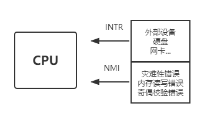
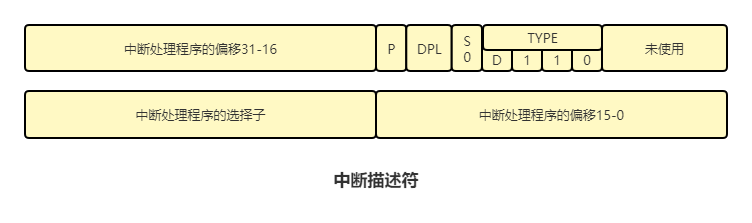
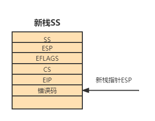

# 中断

## 中断分类

### 外部中断

​	外部中断是来自CPU外部的中断。CPU提供了两条信号线，外部硬件的中断是通过两根信号线来通知CPU的，这两根信号线是INTR和NMI。

​	其中从INTR通过的中断是可屏蔽中断，也就是说CPU可以装作没看见，不去处理INTR输入的中断，但是linux却把中断分为上半部和下半部。

​	比如说，当网卡接收到路由器传输来的数据包时，就会发送中断给CPU，由于网卡的缓存有限，如果CPU不及时处理，网卡的对于后面接收的数据就会被丢掉。所以这个时候网卡发送的中断就像你快点处理，不然我接受不了外部的信号了。CPU赶忙处理掉当前的指令，去把网卡的数据移到自己的缓冲区中，这就是处理网卡中断的上半部，而移过来的数据的处理，也就是网卡中断的下半部，CPU可以选择适当的时机处理。

​	

​	而从NMI传来的中断是不可屏蔽中断，他表示系统发生了致命的错误，计算机直接死机。

### 内部中断

#### 软中断

​		软中断，顾名思义，就是由软件主动发起的中断。

* int 8位立即数：发起**[立即数]**号中断
* int3：int3是调试断点指令

* into：中断溢出指令

#### 异常

异常是内部中断，是CPU内部错误引起的，比如除数为0，不能识别机器码等异常，通常是由逻辑错误产生的。

## 中断描述符表

​	中断描述符表是保护模式下用于存储中断处理程序入口的表(中断描述符)，当CPU接收一个中断后，需要用中断号在表中索引对应的中断描述符。知道中断程序的起始地址，跳转过去执行。

​	而中断描述符表跟GDT一样也是有一个专门的寄存器来存储的，这个寄存器就是IDTR。

## 中断发生时的压栈

* 当中断发生时，处理器根据中断号找到对应的中断描述符，然后获取中断例程的选择子索引到对应的段描述符，这个段描述符即为目标段，获取到此段的DPL，处理器将CPL和DPL对比，如果CPL和DPL相等，则转移过程中不需要切换栈，如果CPL>DPL，那么是从低特权级转移到高特权级，需要切换到高特权级的栈。于是临时保存旧的ss和esp的值，然后在tss中找到同目标代码段DPL级别相同的栈加载到寄存器ss和esp中，再将old_ss和old_esp压入到新栈中，以便返回时切换回原来的栈
* 在新栈中压入EFLAGS寄存器
* 由于要切换到目标代码段，要将CS和EIP保存到栈中备份以便使用**iretd**指令返回时可以返回到正确的代码段
* 由于某些异常会有错误码，所以错误码也需要入栈

## 中断退出时的出栈

* 由于处理器不会自动的将错误码弹出，所以需要手动先将错误码弹出，再执行iretd指令

* 当处理器执行到iretd指令时，首先会比较栈中的CS和当前的CS特权级是否一样，当发现栈中的CS的RPL>CPL时，就知道是从高特权级到低特权级，处理器会检查CS，ES，FS，GS的填充为0。
* 弹出EFLAGS
* 弹出SS，ESP

## 8259A

