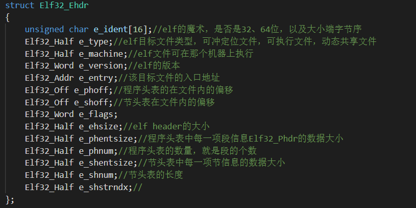
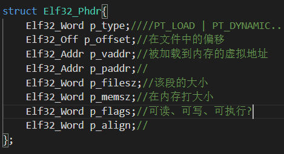

# 加载内核

​		

由于内核是使用C语言来编写的。将C语言编译为目标文件后，也就是使用

```shell
gcc -c ..
```

此时编译后的文件是目标文件，也叫作待重定位文件，待重定位文件是文件里面的符号还没有编址的文件，这些符号的地址需要和其他的目标文件组成一个可执行文件再来编排地址。这里所说的组成就是链接的过程，而在linux中，可以使用ld命令来链接多个目标文件，并且可以指定可执行文件的起始虚拟地址。

## ELF格式

在linux下，被链接后的可执行文件格式是ELF格式，也就是(Executeable and Linkable Format)，可执行链接格式。

想要加载使用C语言编写的内核程序，首先需要编译，然后链接成可执行文件，这样才能读取此文件到内存中进行加载，但是我们需要读取此可执行文件之前，必须要了解ELF格式。




### e-ident-16字节

| e-ident[0-3]=[0x7f,'e','l','f'] | elf文件的魔数                                                |
| ------------------------------- | ------------------------------------------------------------ |
| e-ident[4]                      | 表示elf文件的类型，为0代表不可识别，为1代表是32位可执行文件，为2代表64位可执行文件 |
| e-indet[5]                      | 是大端字节还是小端字节                                       |
| e-ident[6]                      | elf的版本信息，0位非法版本，1位合法版本                      |
| e-ident[7-15]                   | 保留                                                         |


### e-type-2字节

| elf目标文件类型 | 取值 | 意义             |
| --------------- | ---- | ---------------- |
| ET_NONE         | 0    | 未知目标文件     |
| ET_REL          | 1    | 可重定位文件     |
| ET_EXEC         | 2    | 可执行文件       |
| ET_DYN          | 3    | 动态共享目标文件 |


### e-machine-2字节

| 体系结构类型 | 取值 | 意义              |
| ------------ | ---- | ----------------- |
| EM_M386      | 3    | intel 80386可运行 |
| EM_860       | 7    | Intel 80860可运行 |


*  e-version：占用4字节，表示版本信息
* e-entry：占用4字节，表示程序的入口地址
* e-phoff：占用4字节，用来指定程序头表在文件内的偏移量
* e-shoff：占用4字节，用来指定节头表在文件内的偏移量
* e-flags：
* e-ehsize：占用2字节，用来指定elf-header的字节大小
* e-phnum：占用2字节，用来指定程序头表的条目的数量（段的个数）
* e-phentsize：占用2字节，用来指定程序头表中每个条目的字节大小
* e-shentsize：占用2字节，用来指定节头表中每个条目的字节大小
* e-shnum：占用2字节，用来指定节头表的条目的数量


## ELF格式的程序头




* P_TYPE：占用4字节，表示段的类型

| 类型       | 取值 | 说明             |
| ---------- | ---- | ---------------- |
| PT_NULL    | 0    | 忽略             |
| PT_LOAD    | 1    | **可加载程序段** |
| PT_DYNAMIC | 2    | 动态链接信息     |

* p_offset：占用4字节，表示在文件中的偏移
* p_vaddr：占用4字节，用来指定本段在内存中的其实虚拟地址
* p_paddr：
* p_filesz：占用4字节，用来指定本段在文件中的大小
* p_memsz：占用4字节，用来指定本段在内存中的大小
* p_flags：占用4字节，用来指定本段相关的标志

| 类型 | 取值 | 说明               |
| ---- | ---- | ------------------ |
| PF_X | 1    | 本段具有可执行权限 |
| PF_W | 2    | 本段具有可写权限   |
| PF_R | 4    | 本段具有可读权限   |


虽然ELF-header有很多信息，但是对于目前加载来说，只需要用到少量的东西。

## 加载内核的步骤


当将内核程序链接完成，并写入到磁盘后，就可以在内核加载器中读取内核文件到内存中，然后根据ELF格式就可以将内核加载到指定的内存中。

1. 获取ELF-header的phnum，当做循环的次数
2. 获取第一个程序头表的偏移e-phoff，用作基地址，并且获取e-phentsize，加载完一个程序头后，将基地址加上e-phentsize，加载下一个程序头
3. 在循环中，获取程序头p-filesz，这是该段的大小，获取p_vaddr，这是该段被加载的目的地址。获取p_offset，再加上内核被读入到内存中的首地址既是该段的源地址。然后进行加载即可


## 补充

 由于作者的环境是32位的系统，而我使用了64位的系统，所以在编译和链接的时候需要加上一些参数

```shell
gcc -m32 -fno-stack-protector ...
```

```shell
ld -m elf_i386 ...
```


