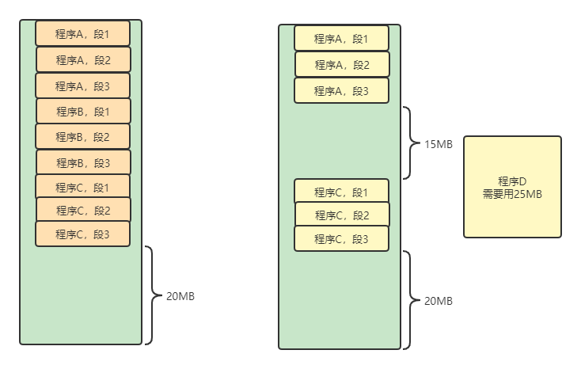
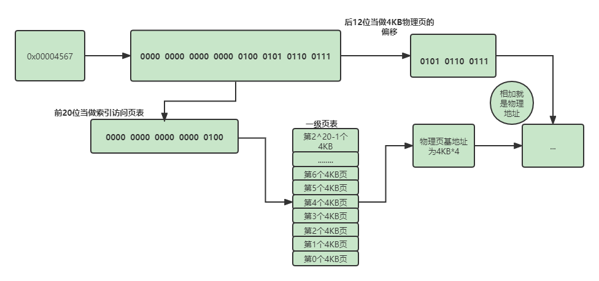

# 开启分页

## 为什么要开启分页

​	在没有开启分页前，段基址加上偏移地址之后的线性地址就是物理地址，这样访问内存是有缺陷的。也就是一个应用程序，他的线性地址势必是连续的，而线性地址和物理地址是一一映射的，当操作系统加载了许多个应用程序时，这些程序有的早早结束使命，不再使用内存，于是在内存中肯定会产生内存碎片，这样的话再次加载一个占用内存比较大的应用程序时，就没有连续的地址空间来存放了。但是这些内存碎片的总大小还要大于这个应用程序，这样就造成了内存的浪费。

​	造成这个问题的原因就是线性地址和物理地址是连续的，所以，如果线性地址是连续的和而对应的物理地址不连续的话，这个问题就可以迎刃而解。

## 一级页表

​	在4GB的内存空间下，地址线是32条，每个地址占4个字节。一级页表的便是将32位的地址拆分，0-11位的地址看做是页的大小，12-31位的地址看做是页的数量。

​	所以页的大小就是2^12=4KB，而页的数量就是2^20=1MB，总的内存为1MB*4KB=4GB

​	当然上面的描述可能有点云里雾里。如果使用一级页表来分页的话，访问一个地址例如0x00004567，是如何映射到物理地址的呢？

## 二级页表

### 有了一级页表了，为什么还要二级页表呢？

