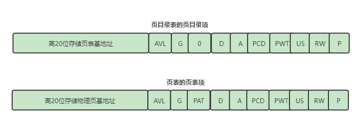

# 开启分页

## 为什么要开启分页

​	在没有开启分页前，段基址加上偏移地址之后的线性地址就是物理地址，这样访问内存是有缺陷的。也就是一个应用程序，他的线性地址势必是连续的，而线性地址和物理地址是一一映射的，当操作系统加载了许多个应用程序时，这些程序有的早早结束使命，不再使用内存，于是在内存中肯定会产生内存碎片，这样的话再次加载一个占用内存比较大的应用程序时，就没有连续的地址空间来存放了。但是这些内存碎片的总大小还要大于这个应用程序，这样就造成了内存的浪费。

​	造成这个问题的原因就是线性地址和物理地址是连续的，所以，如果线性地址是连续的和而对应的物理地址不连续的话，这个问题就可以迎刃而解。

## 一级页表

​	在4GB的内存空间下，地址线是32条，每个地址占4个字节。一级页表的便是将32位的地址拆分，0-11位的地址看做是页的大小，12-31位的地址看做是页的数量。

​	所以页的大小就是2^12=4KB，而页的数量就是2^20=1MB，总的内存为1MB*4KB=4GB

​	当然上面的描述可能有点云里雾里。如果使用一级页表来分页的话，访问一个地址例如0x00004567，是如何映射到物理地址的呢？

## 二级页表

### 有了一级页表了，为什么还要二级页表呢？

​		由于一级页表有2^20这么多项，每一项存储4字节，所以一级页表占用的内存为：4*2^20=4MB，这样的话一个应用程序就会加载的时候同时需要加载4MB的页表，当用户程序一多，页表占用的内存就足够可观了。造成这个现象的原因是页表是立即加载的，正常来说，一个应用程序很少可以占用4GB的全部空间，所以一级页表其实有很多项是没有使用的，但是又不得不将这个页表提前申明。所以一级页表的缺点就是不能按需加载。

## 二级页表的结构

​		由于物理页的标准尺寸就是4KB，只需要占用12个比特，此时一级页表不再存储物理页的基地址，而是使用二级页表来存储物理页的基地址，每个二级页表可以存储1024个物理页基地址，在4GB空间中，有1M个4KB物理页，所以二级页表应该有1M/1024=1024，因此总共有1024个二级页表，这些二级页表也是需要存储的，一级页表就被使用来存储这些二级页表的基地址了。

​		其中一级页表被称为页目录表，二级页表被称为页表，页目录表的每一项存储的就是页表，页表的每一项存储的是物理页。

## 页表项存储的4字节地址

​		由于页目录项的存储1024个页表，每一项存储4字节，那么页表的大小为4KB，同理二级页表的大小也是4KB，物理页的标准尺寸也是4KB，而以4KB为倍数地址的特性是高20位才是有效的，低12位并没有发挥作用。

​		所以页目录和页表存储的4字节地址的低12位也是代表着一些特殊含义的

* p为代表此处的页表或者物理页是否存在，1表示存在
* RW代表此处的存储的页表或者物理页是否可写可读。1代表可读可写，0代表可读不可写
* US代表普通用户/超级用户，为1时，任意级别的程序都可访问，为0时，特权级为3的用户程序不可访问，其他特权级的程序皆可访问
* A代表访问位，为1表示已经被CPU访问过，此位可以和P为一起使用，操作系统可以定期的将此位请0，记录A变成1的个数，当内存不足时，可以将访问频率比较低的页表换到外存，并设置p位为0，当再次访问此物理页时会触发pagefault异常，此时操作系统就可以将外存存储的数据再换回来。

## 分页的步骤

1. 准备好页目录表和页表
2. 将页表地址写入到CR3中
3. 将CR0的PG位置1

