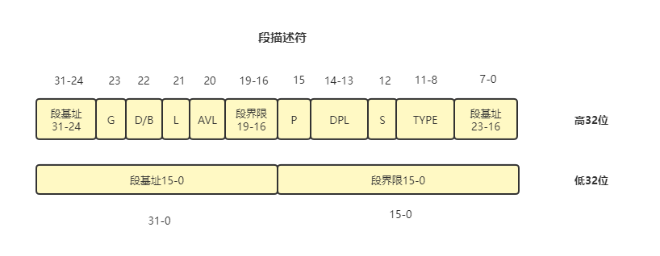
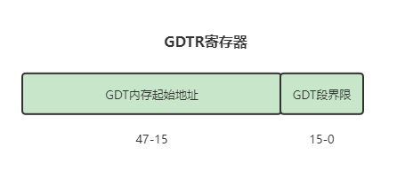
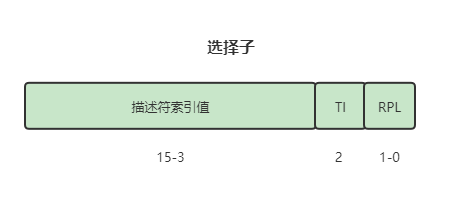

# 进入保护模式

## 为什么要进入保护模式呢？

1. 8086CPU的运行模式被称为实模式

2. 由于在8086横行的时候，CPU只能寻址1MB的地址空间，当地址超过了FFFFF的时候，就会形成地址回绕，也就是从0开始。随着计算机的发展，后来CPU的寻址空间也在增大，可是计算机行业之所以能如火朝天的原因之一就是向下兼容，所以为了兼容1MB地址环绕的特性，IBM公司设置了一个A20gate来控制A20地址线，当A20gate被禁止时，只能访问1MB的内存。所以在实模式下，计算机只能访问1MB的内存，这是不可忍受的。
3. 在实模式下，地址的访问方式是段基址加上偏移地址，形成后的地址就是物理地址，也就是说程序员是可以指哪打哪，想访问那个内存就访问那个内存。
4. 实模式下没有特权级的区分，用户程序和操作系统属于一个等级，操作系统很危险。。。

## 段描述符

​	在保护模式下，一个内存段需要提前定义好才能使用，不会像实模式下那样只要段基址加上偏移地址就访问到了内存。保护模式下，基址寄存器例如cs，ds，es等等存储的不再是段基址，它们都存储一个称作选择子的东西来访问全局描述符表，获取段描述符，然后CPU从段描述符中获取段基址，再加上程序提供的偏移地址才能访问到内存。

* 段基址：段的起始地址

* 段界限：段的界限，和G为搭配使用

* G：表示段界限的单位量，为0时段界限的单位是1B，为1时段界限的单位是4KB
  $$
  真实段界限=(段界限-1)*(段界限粒度)-1
  $$

* D/B位：

  * 对于代码段来说，此位是D位，当D为1时，代表代码段的指令都是32位大小，使用EIP寄存器获取指令，当D为0时，表示指令都是16位大小，使用IP寄存器获取指令
  * 对于栈段来说，此位是B位，当B为1是，使用ESP作为栈指针，当B为0时，使用SP作为栈指针

* L位：L为0表示32代码段，L为1表示64位代码段

* AVL：保留

* P：代表此段是否存在

* DPL：描述符特权级，0,1,2,3

* S：S为1代表数据段，在CPU眼中代码段也属于数据段。S为0代表系统段，系统段便是各种门结构的描述符，例如调用门，中断门，任务门等等

* TYPE：用来指定段的具体类型，当S为1时，并且TYPE的X位为1时，代表此段是代码段，否则是数据段

| X                       | C            | R                      | A    |
| ----------------------- | ------------ | ---------------------- | ---- |
| 1，表示可执行，是代码段 | 一致性代码段 | 1表示可读，0表示不可读 |      |

| X                       | E                            | W                      | A    |
| ----------------------- | ---------------------------- | ---------------------- | ---- |
| 0表示不可执行，是数据段 | 0表示向上扩展，1代表向下扩展 | 1表示可写，0表示不可写 |      |

## GDT和选择子

有了段描述符这种结构之后，该怎么去访问它呢，所以必须有一个内存段专门来存储这些段描述符。而GDT(Global Descriptor Table)，就是存储段描述符的一个东西，GDT位于内存当中，需要用一个寄存器来指定它，这个寄存器就是GDTR。

GDTR是一个长度为48字节的寄存器，0-15位表示GDT的界限，也就是2^16，每个段描述符的8字节。65536/8=8192，GDT可以容纳8192个段或门。

15-47位表示GDT的起始地址。

但是虽然有了GDT这个东西，CS，DS，ES，SS这些段寄存器都还是16位的，在实模式下这些寄存器存储的是段基址，但在保护模式下这些寄存器存储的是段选择子。

其中3-15位用来索引GDT的段描述符，TI位表示索引的是GDT还是LDT（局部描述符），RPL代表请求特权级。

## 进入保护模式的三个步骤：

1. 打开A20地址线，只有打开了A20地址线，才能访问1MB之外的内存
2. 加载GDT全局描述符表，在保护模式下，访问地址和实模式下有了一些区别，虽然都是以段基址加上偏移地址形成的线性地址，但是保护模式提供了全局描述符表，要想使用段，必须要提前将段定义好，组装成段描述符，加载到gdt当中，最后根据段选择子来获取GDT的描述符，形成段基址，加上偏移地址才是线性地址。所以在保护模式下，没有加载GDT，程序将寸步难行。
3. 打开寄存器CR0的PE位(第0位)

